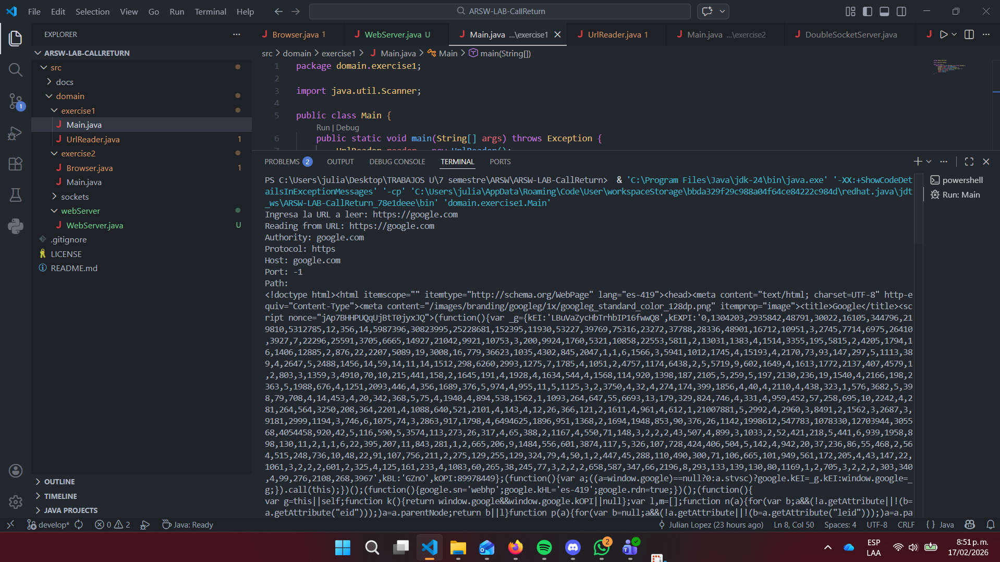
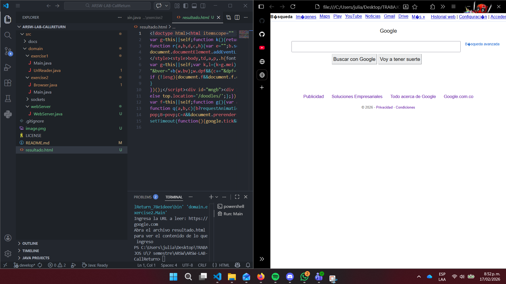
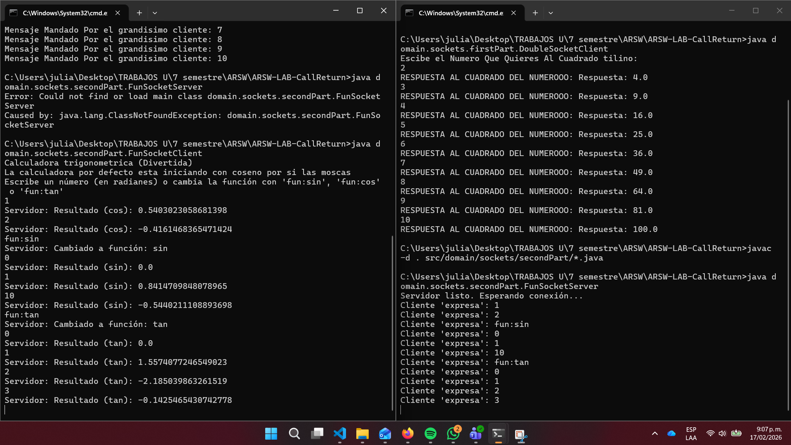
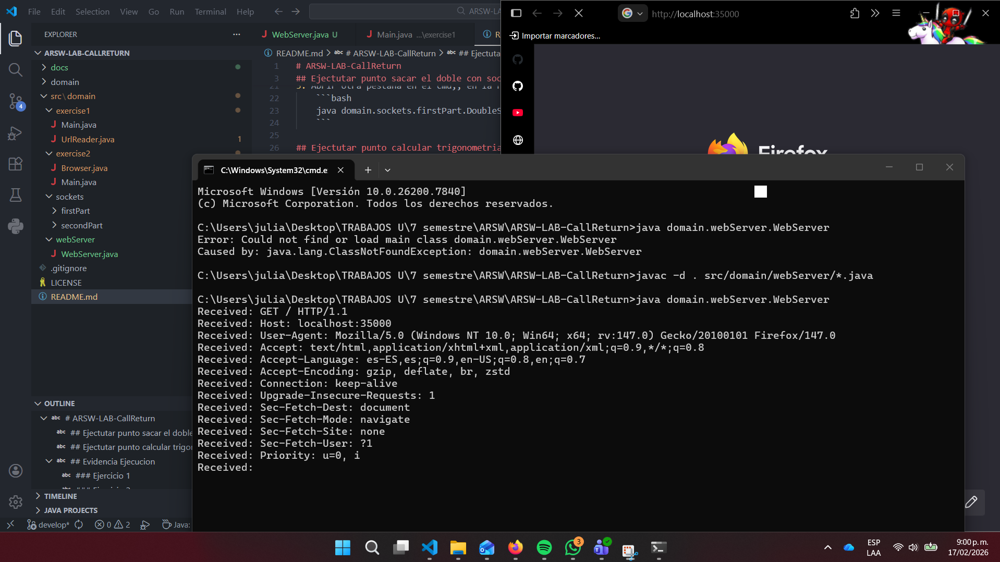
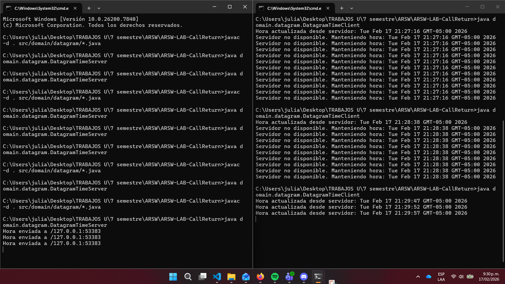

# ARSW-LAB-CallReturn
# Escuela Colombiana de Ingeniería – Arquitecturas de Software  

En este repositorio se encontrara la solucion a ejercicios propuestos en el laboratorio "CallReturn" en el cual se trataron temas como: ejecución cliente/servidor, sockets y datagramas

## 🕵️ Ejectutar punto sacar el doble con sockets

1. Clonar el repositorio a la maquina local:
   ```bash
    git clone <URL_DEL_REPOSITORIO>
    ```
2. Navegar al directorio del repositorio
    ```bash
    cd <NOMBRE_DEL_PROYECTO>
    ```
3. Compilar El proyecto
    ```bash
    javac -d . src/domain/sockets/firstPart/*.java
    ```
4. En un cmd ejectutar 
    ```bash
    java domain.sockets.firstPart.DoubleSocketServer
    ```
5. Abrir otra pestaña en el cmd,, en la raiz del repositorio y ejecutar
    ```bash
    java domain.sockets.firstPart.DoubleSocketClient
    ```

## 🕵️ Ejectutar punto calcular trigonometria con sockets

1. Clonar el repositorio a la maquina local:
   ```bash
    git clone <URL_DEL_REPOSITORIO>
    ```
2. Navegar al directorio del repositorio
    ```bash
    cd <NOMBRE_DEL_PROYECTO>
    ```
3. Compilar El proyecto
    ```bash
    javac -d . src/domain/sockets/secondPart/*.java
    ```
4. En un cmd ejectutar 
    ```bash
    java domain.sockets.secondPart.FunSocketServer
    ```
5. Abrir otra pestaña en el cmd,, en la raiz del repositorio y ejecutar
    ```bash
    java domain.sockets.secondPart.FunSocketClient
    ```

## 🕵️ Ejectutar punto WebServeer
1. Clonar el repositorio a la maquina local:
   ```bash
    git clone <URL_DEL_REPOSITORIO>
    ```
2. Navegar al directorio del repositorio
    ```bash
    cd <NOMBRE_DEL_PROYECTO>
    ```
3. Compilar El proyecto
    ```bash
    javac -d . src/domain/webServer/*.java
    ```
4. En un cmd ejectutar 
    ```bash
    java domain.webServer.WebServer
    ```
5. Abrir en el navegador y buscar `http://localhost:35000`

## 🕵️ Ejectutar punto DatagramTime
1. Clonar el repositorio a la maquina local:
   ```bash
    git clone <URL_DEL_REPOSITORIO>
    ```
2. Navegar al directorio del repositorio
    ```bash
    cd <NOMBRE_DEL_PROYECTO>
    ```
3. Compilar El proyecto
    ```bash
    javac -d . src/domain/datagram/*.java
    ```
4. En un cmd ejectutar 
    ```bash
    java domain.datagram.DatagramTimeServer
    ```
5. Abrir otra pestaña en el cmd,, en la raiz del repositorio y ejecutar
    ```bash
    java domain.datagram.DatagramTimeClient

## 📖 Evidencia Ejecucion 

### 📷 Ejercicio 1


### 📷 Ejercicio 2


### 📷 Servidor Cuadrado del numero


### 📷 Servidor calculadora trigonometrica



### 📷 Conexion Browser Web Server



### 📷 Servidor hora cada 5 seg



## 🙋 Autor

* **Julian Camilo Lopez Barrero** - [JulianLopez11](https://github.com/JulianLopez11)

